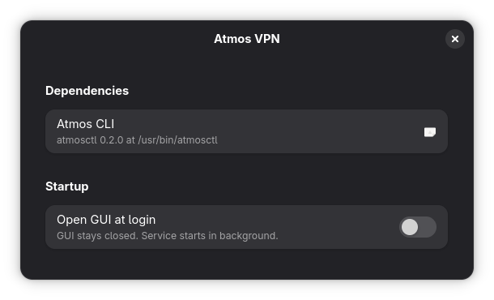

#  Atmos GNOME

GNOME Shell Quick Settings toggle for the Atmos Agent VPN client.

## Settings

The Atmos VPN GUI startup behavior can be managed from the extension settings.



## Requirements

- Atmos Agent installed locally.
- `atmosctl` 0.3.0 or newer from [`atmos-cli`](https://github.com/reuben-geonet/atmos-cli)

When Atmos is logged out, the Quick Settings tile shows `Logged out` and opens
the Atmos application when clicked instead of trying to resume the VPN.

## Install

### From GNOME Extensions (Recommended)

[](https://extensions.gnome.org/extension/10075/atmos-vpn/)

[](https://extensions.gnome.org/extension/10075/atmos-vpn/)

### From Source

#### Build

```sh
make pack
```

This creates `<extension-uuid>.shell-extension.zip` in the repository root.

#### Install

```sh
make install
gnome-extensions enable <extension-uuid>
```

On Wayland, log out and back in after installing or updating the extension.
